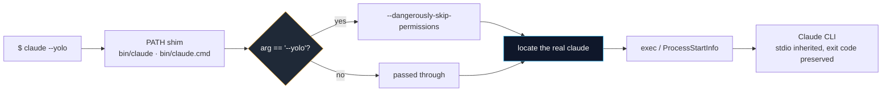

<div align="center">

<h1>claude-yolo</h1>

<h3><em>Claude's best flag deserved a shorter name.</em></h3>

<p>
  A PATH shim that rewrites <code>--yolo</code> to <code>--dangerously-skip-permissions</code>
  and hands everything else to the real Claude CLI, untouched.<br/>
  No patching, no dependencies, under a hundred lines of shell per platform.
</p>

[](https://github.com/khanalsaroj/claude-yolo/actions/workflows/test.yml)
[](#install)
[](bin/claude)
[](bin/claude.ps1)

[](LICENSE)

<sub>
  <a href="#install"><b>Install</b></a> &nbsp;|&nbsp;
  <a href="#what-it-translates"><b>What it translates</b></a> &nbsp;|&nbsp;
  <a href="#how-it-works"><b>How it works</b></a> &nbsp;|&nbsp;
  <a href="#environment-variables"><b>Environment variables</b></a> &nbsp;|&nbsp;
  <a href="#development"><b>Development</b></a> &nbsp;|&nbsp;
  <a href="#faq"><b>FAQ</b></a>
</sub>

</div>

---

Typing `--dangerously-skip-permissions` gets old around the fourth time. This is the whole fix:

```bash
claude --yolo "fix this bug"
```

runs

```bash
claude --dangerously-skip-permissions "fix this bug"
```

That is the entire feature. `claude-yolo` puts a small `claude` script earlier on your `PATH`, swaps that one argument, then execs the real binary. It does not modify Claude, patch anything on disk, or sit between you and the process afterwards. Arguments, stdin, stdout, stderr, and the exit code all pass through as they were.

> It is unofficial and not affiliated with Anthropic.

---

## Install

Claude CLI has to already be on your `PATH`. The installer records where it found it.

**macOS and Linux**

```bash
curl -fsSL https://raw.githubusercontent.com/khanalsaroj/claude-yolo/main/install.sh | sh
```

From a clone, run `./install.sh` instead. Either way the wrapper lands in `~/.claude-yolo/bin` and a PATH line is appended to your shell profile, guarded by `# >>> claude-yolo >>>` markers so the uninstaller can find it again. Pass `--no-profile` to skip the profile edit and put the directory on `PATH` yourself.

**Windows**

```powershell
Set-ExecutionPolicy RemoteSigned -Scope CurrentUser
iwr -useb https://raw.githubusercontent.com/khanalsaroj/claude-yolo/main/install.ps1 | iex
```

From a clone, run `.\install.ps1`. The wrapper goes to `%USERPROFILE%\.claude-yolo\bin` and that directory is prepended to your user `Path` (skip it with `-NoPath`).

Open a new terminal afterwards so the updated `PATH` takes effect.

**Uninstall**

```bash
./uninstall.sh      # macOS, Linux
```
```powershell
.\uninstall.ps1     # Windows
```

Both remove only what the installer created: the wrapper files, the cached `original-path`, and the PATH entry.

---

## What it translates

Exactly one argument, matched exactly. Nothing is parsed, guessed at, or rewritten by pattern.

| You type                        | Claude receives                                     |
|---------------------------------|-----------------------------------------------------|
| `claude --yolo`                 | `claude --dangerously-skip-permissions`             |
| `claude --yolo "fix this bug"`  | `claude --dangerously-skip-permissions "fix this bug"` |
| `claude chat --yolo --print`    | `claude chat --dangerously-skip-permissions --print` |
| `claude --yolo=true`            | `claude --yolo=true` (untouched)                     |
| `claude --some-flag --yolo`     | `claude --some-flag --yolo` (untouched as a value)   |
| `claude update`                 | `claude update`                                      |

The match is case sensitive and whole-argument. An argument that merely contains `--yolo`, or one that happens to be another flag's value, is left alone, because the wrapper walks the argument vector rather than the command line as a string.

---

## How it works



Finding the real executable is the only part with any logic to it, and both wrappers do it in the same order:

1. **`CLAUDE_YOLO_ORIGINAL`, if set.** This is authoritative. A wrong value fails with exit 127 rather than silently falling back to something else, which is what makes the tests trustworthy.
2. **The cached `original-path` file**, written next to `bin/` at install time.
3. **A `PATH` scan**, skipping the wrapper's own directory. This is the self-heal case: reinstall Claude somewhere else and the cached path goes stale, so the wrapper rediscovers it instead of breaking.

If none of those produce an executable file, the wrapper prints one line to stderr and exits 127.

<details>
<summary><b>Why the Windows side looks more complicated</b></summary>

<br/>

`bin/claude.cmd` is a two-line trampoline into `bin/claude.ps1`, and the PowerShell script launches Claude through `ProcessStartInfo` with `UseShellExecute = $false` and no stream redirection. Both choices are load-bearing.

The call operator (`&`) would wrap the child's native stderr into PowerShell `ErrorRecord` objects and mangle the exit code. `ProcessStartInfo` does not. Leaving stdout and stderr un-redirected is what lets Claude's interactive UI see a real console, so colors, raw keyboard input, and the TUI keep working. Adding `RedirectStandardOutput` or `RedirectStandardError` breaks the interactive session.

When the real `claude` turns out to be a `.cmd` or `.bat` file, it has to run through `cmd.exe`, which re-parses `& | < > ( ) ^` even inside an already-quoted argument. Those arguments get an extra layer of quoting so cmd treats them as literal text. Embedded quotes and `%VAR%` through that same path remain an unsolved cmd and MSVCRT quoting limitation, not something the wrapper can paper over.

</details>

---

## Environment variables

| Variable                | Default                                                        | What it does                                                      |
|-------------------------|----------------------------------------------------------------|-------------------------------------------------------------------|
| `CLAUDE_YOLO_ORIGINAL`  | unset                                                          | Forces the path to the real Claude. Authoritative, no fallback.   |
| `CLAUDE_YOLO_HOME`      | `~/.claude-yolo`, `%USERPROFILE%\.claude-yolo`                 | Install root.                                                     |
| `CLAUDE_YOLO_PROFILE`   | picked from `$SHELL` (`.zshrc`, `.bashrc`, `.profile`)         | Which shell profile the POSIX installer edits.                    |
| `CLAUDE_YOLO_REPO_URL`  | the GitHub raw URL for `main`                                  | Where installers fetch wrappers when not run from a clone.        |

---

## Development

There is no build, no lint, and nothing to install. `bin/claude` (POSIX) and `bin/claude.ps1` plus `bin/claude.cmd` (Windows) are the product. Installers copy those files when run from a clone and download them otherwise, so a wrapper never gets duplicated inside an installer where it could quietly drift.

```bash
sh test/run.sh          # argument translation, stdio, exit-code propagation
sh test/install.sh      # the installed artifact, download path, and self-heal
```
```powershell
./test/windows.ps1          # Windows wrapper
./test/windows-install.ps1  # Windows installer, sandboxed with -NoPath
```

No test ever touches a real Claude install. `CLAUDE_YOLO_ORIGINAL` points at a fake `claude` that echoes its arguments to both streams and honours `FAKE_EXIT_CODE`, and installs are sandboxed through `CLAUDE_YOLO_HOME` and `CLAUDE_YOLO_PROFILE` so your actual shell profile and user `PATH` are never written to.

There is no runner and no filtering. Each file is a flat sequence of assertions, so running a single case means commenting out the others for a moment. CI runs the sh tests on Linux and macOS and the ps1 tests on Windows.

---

## FAQ

<details>
<summary><b>Does this change my Claude installation?</b></summary>
<br/>
No. Nothing is patched, wrapped, or overwritten. A second script named <code>claude</code> sits earlier on your <code>PATH</code> and execs the real one.
</details>

<details>
<summary><b>What happens to my other flags?</b></summary>
<br/>
They arrive exactly as you typed them, including quoting and spacing. Only a whole argument equal to <code>--yolo</code> is replaced.
</details>

<details>
<summary><b>Do interactive sessions still work?</b></summary>
<br/>
Yes. Standard input, output, and error are inherited rather than redirected, so the TUI, colors, and prompts behave as if you had run <code>claude</code> directly.
</details>

<details>
<summary><b>What if I reinstall Claude somewhere else?</b></summary>
<br/>
The wrapper notices the cached path no longer points at an executable and rescans <code>PATH</code> for a <code>claude</code> outside its own directory. No reinstall required.
</details>

<details>
<summary><b>Why exit code 127?</b></summary>
<br/>
It is the conventional "command not found" code, and it means a missing or wrong <code>CLAUDE_YOLO_ORIGINAL</code> fails loudly instead of running some other <code>claude</code> you did not ask for.
</details>

<details>
<summary><b>Is <code>--dangerously-skip-permissions</code> actually safe?</b></summary>
<br/>
That is between you and your filesystem. The flag lets Claude act without asking first, and giving it a shorter name does not make it less dangerous. Use it in a directory and on a machine you would not mind Claude having free rein over.
</details>

---

## License

MIT. See [LICENSE](LICENSE).

<div align="center">
<br/>
<sub><i>claude-yolo. Six characters instead of thirty.</i></sub>
</div>
